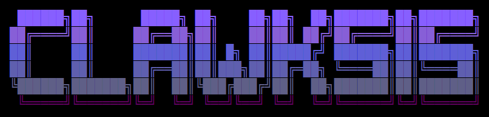

  

<h1 align="center">Clawksis</h1>

  <b>Tu agente de IA autónomo, self-hosted.</b> 
  Hablale desde Telegram, WhatsApp o Discord mientras trabaja en tu VPS. 
  Aprende de cada sesión, crea sus propias skills y mejora con el uso.

  
  
  

---

# Documentación — Línea de tiempo de Clawksis

Registro **día por día** de lo que se construyó en Clawksis desde su primer publish (2026-06-04). Para cada cambio relevante se anota: **qué se hizo**, **cómo se usa** (comando, cuando aplica) y **para qué sirve**. Los commits de CI, formato y tests se resumen al cierre de cada día.

> Todos los comandos usan el binario `clawk`. Cualquiera acepta `clawk <comando> --help` para ver subcomandos y flags.

Índice rápido: [04 jun](#2026-06-04--nace-clawksis) · [05 jun](#2026-06-05--dashboard-real--marca-morada) · [08 jun](#2026-06-08--persona-proactiva-comandos-auth) · [09 jun](#2026-06-09--independencia-de-nous--byok) · [10 jun](#2026-06-10--acceso-remoto-setup-pulido-agentes-de-coding) · [11 jun](#2026-06-11--visualización--sync-upstream) · [13 jun](#2026-06-13--integración-de-ramas-a-main--sync-v202665)

---

## 2026-06-04 — Nace Clawksis

**Fork standalone (MIT)** · `ce9b3a12`
Se publicó Clawksis como fork independiente del motor de agente, con licencia MIT, separado de Hermes.
- Para qué sirve: tener un agente propio, sin dependencia de la infraestructura original.

**Rebrand inicial** · `63c88c13` `577d3850` `d4eb0e6e` `36f48df4`
Banner CLAWKSIS, se reemplazó el símbolo de Hermes `⚕` por el nabla `∇` (Gradient AI), skin vinotinto y logo en todos los comandos (setup, uninstall, doctor, gateway).
- Cómo se ve: `clawk setup`, `clawk doctor`, etc. muestran el branding nuevo.

**Home unificado en `~/.clawksis`** · `a5f77d27` `c6d18500`
Se unificó el directorio de configuración (antes partido entre `~/.clawk` en Python y `~/.clawksis` en el installer).
- Comando: `clawk config path` / `clawk config env-path` para ver las rutas.
- Para qué sirve: que config, `.env`, sesiones, skills y memorias vivan en un solo lugar.

**Build del dashboard en la instalación** · `4bb9d9b1`
El dashboard web se compila durante el install.
- Cómo se usa: `clawk dashboard` lo abre.

**README completo + quitar Nous Portal del wizard** · `c6d18500` `b38c0730` `01d8f420`
Documentación completa y limpieza de referencias a Nous Portal en los textos visibles del setup.

_Otros (internos):_ 4 bugs del rebrand (`eb06a9bb`), SyntaxError en Python 3.12 (`8cd813c9`), CI simplificado quitando workflows de Hermes (`5a0e5ca0`), node_modules fuera del repo (`bfb7e875`).

---

## 2026-06-05 — Dashboard real + marca morada

**Marca morada `#6C4FD6`** · `189344d3` `67a60403` `3e31355e` `72cc075e`
Barrido de color a morado en CLI, skin engine, TUI y website; logo ANSI Shadow (estilo 3D outlined) y figura con gradiente morado.

**Controles reales en el dashboard:**
- **Toggle de Toolsets** · `00d4dc66` — activar/desactivar toolsets desde la web. Equivalente web de `clawk tools`.
- **Channels: borrar credenciales** · `99cd96e9` — limpiar credenciales guardadas de un canal desde el modal.
- **Webhooks: delivery dinámico + skills y chat_id** · `79b559fc` — equivalente web de `clawk webhook subscribe`. Sirve para activar al agente por eventos externos.
- **Cron: campos avanzados** · `0b6fcd01` — model/provider, skills, repeat, script/no-agent, context_from, toolsets, workdir, deliver=origin. Equivalente web de `clawk cron create` con sus flags.
- **MCP: buscador/filtro del catálogo** · `cdb5c48c`.
- **Env: validar credenciales al guardar** · `d66205ca`.
- **Docs: overview local** · `86744d8d` — reemplaza un iframe roto de GitHub.
- **Pista de foreground + túnel SSH al arrancar** · `c4e2e8fe`.

**Panel "Novedades" al iniciar** · `e0bb837d`
Muestra los últimos commits al abrir Clawksis.
- Cómo se ve: al ejecutar `clawk`.

**`clawk update` discreto** · `2ef9adcd` `836a7464`
Spinner morado + output de npm capturado (oculta banner UNICODE/EBADENGINE).
- Comando: `clawk update`.

**Fix split-brain `.clawk` → `.clawksis`** · `ca4ff7bf` `fcd468a3` `c4030cf8`
Se corrigió el home-dir en ~30 archivos de producción (systemd install, file_safety, marcador sandbox-mirror).
- Para qué sirve: que todo apunte a `~/.clawksis` y no quede un `.clawk` huérfano.

**Modelo por defecto vacío** · `565680ee`
El modelo se elige en el setup en vez de venir precargado.
- Comando: `clawk setup` / `clawk model`.

**SOUL pragmático con credenciales** · `b425b0dd`
Persona que ayuda a configurar credenciales sin sermón de "comprometido".

_Otros (internos):_ line endings LF + `.gitattributes` (`1dad93ff`), ruff format del repo y fix del job de Lint (`3e33d8ec`), tests de color a morado, fixes de tests dependientes de models.dev (xfail).

---

## 2026-06-08 — Persona proactiva, comandos, auth

**Proactividad estilo secretaria** · `5a4431b5` `02606ed4`
La persona agenda check-ins con cronjob y reporta al jefe; siembra un check-in proactivo aleatorio para el día siguiente (cron once + deliver=origin).
- Cómo se usa: vive en la persona (SOUL) + cron. Ver con `clawk cron list`.
- Para qué sirve: que el agente sea proactivo, no solo reactivo.

**`clawk soul` — ver/editar la personalidad** · `8bea96c3` `52343fff` `e1aa6c65`
`SOUL.md` se siembra solo desde `default_soul.py` (bundled en git).
- Comando: `clawk soul` · `clawk soul show` · `clawk soul path`.
- Para qué sirve: ver y editar la personalidad del agente.

**`clawk user` y `clawk memory show/edit`** · `835eaefd` `8a8bbe8f`
- Comandos: `clawk user` (perfil USER.md), `clawk memory show` / `clawk memory edit` (MEMORY.md).
- Para qué sirve: ver/editar el perfil del usuario y la memoria del agente.

**Referencia de comandos + Proveedores soportados en el README** · `2f98f37d` `ffa6e649` `afac9d85`
Tabla completa de comandos del fork y sección de proveedores (OAuth + API key).
- Comandos clave: `clawk auth add anthropic --type oauth` (login Claude), `clawk auth add openai-codex --type oauth` (login Codex).

**Auto-instalar Claude Code + Codex CLIs en el setup** · `8a70b575`
- Cómo se usa: durante `clawk setup` se ofrecen e instalan las CLIs.

**Seguridad: bump `react-router-dom`** · `b53e8142`
Corrige DoS GHSA-8x6r-g9mw-2r78 (2 vulns high).

---

## 2026-06-09 — Independencia de Nous / BYOK

**"created by Nous Research" → "created by Gradient AI"** · `6880a434`
En persona e identidad.

**Primer arranque BYOK** · `3e18dab8` `4fc5036c` `4579d47b`
Se sacó el Quick Setup de Nous; Nous Portal sale del picker (`CANONICAL_PROVIDERS`); `clawk portal` y `clawk setup --portal` redirigen a BYOK.
- Comando: `clawk setup`.
- Para qué sirve: usás tu propia API key, sin portal intermedio.

**Web: footer Gradient AI + logo/favicon Clawksis** · `cfb85c23` `cfd2cf59`
Footer org → Gradient AI con link a clawksis.com; logo squircle morado `#6C4FD6` + garras.

_Docs:_ se sacaron las filas de Nous Portal del README (`52313ee1` `cf72bd5f`).

---

## 2026-06-10 — Acceso remoto, setup pulido, agentes de coding

**Dashboard remoto vía túnel SSH** · `3c50a446` (#11) `4cf3006a` (#16) `b7446f83` (#15)
- Comando: `clawk dashboard --remote USER@HOST` (agregá `--start` para arrancarlo en el remoto, `--ssh-opt` para opciones de ssh).
- Para qué sirve: abrir el dashboard de un servidor remoto sin `ssh -L` manual; sobrevive al logout SSH; pista morada cuando está sobre loopback.

**Login OIDC self-hosted + `clawk connect`** · `f62197d3` (#12)
- Comando: `clawk connect` (API key personal); docs de login OIDC self-hosted del dashboard.
- Para qué sirve: acceso al dashboard con tu propio IdP.

**Install & update silenciosos (solo barras moradas)** · `27e854fc` (#14) `bfaa10cd` `4f6f9a99`
- Comando: `clawk update`.
- Para qué sirve: salida limpia (spinners + lista de commits); además reconstruye el bundle del TUI, no solo la web.

**Setup: siempre pedir modelo + describir cada opción** · `b67060ff` `b8931496`
- Comando: `clawk setup`.

**Agentes de coding externos + MiroFish** · `79e0eac4`
- Comando: `clawk tools` (toggles por CLI: Codex, Claude Code, OpenCode; MiroFish es un server HTTP, no una CLI).
- Para qué sirve: usar CLIs de coding externas desde el agente.

**Rebrand del chat (wordmark + tagline + fondo)** · `9e0488d4`
**Welcome check-in sembrado en el install** · `049d9306`.

---

## 2026-06-11 — Visualización + sync upstream

**Sección Visualización del dashboard** · `8258964e` `a9382d65` `9d6a983a` `b5e9f4a1`
Pixel office + feed de actividad + grafo de comunicaciones; oficina intercambiable, burbujas de actividad, líneas de delegación; árbol de delegación (`delegate_task`) para todos los agentes; log de eventos cross-proceso para que aparezca cada agente, no solo la sesión del chat.
- Cómo se usa: `clawk dashboard` → pestaña **Visualización**.
- Para qué sirve: ver en vivo qué hacen los agentes y cómo se comunican.

**Calendario visual para crons one-shot** · `64960d80`
En el ScheduleBuilder del dashboard.
- Equivalente web de `clawk cron create` para tareas de una sola vez.

**Tooling de sync con upstream + release watcher** · `6df084d1` (#19) `c8fdef75`
- Para qué sirve: sincronizar cambios curados desde el agente upstream y vigilar releases.

**Limpieza BYOK** · `eab41ac6` `6c7cd684`
Se sacó Nous de las cadenas de fallback automáticas del cliente auxiliar; se silenció el ruido de proveedores no configurados.

**Tipografía más gruesa + fondo animado + persist de keys env-only** · `59d14c72` `b53dd467`
- `b53dd467`: las API keys env-only ahora se persisten para que el gateway pueda resolverlas.

---

---

## 2026-06-13 — Integración de ramas a main + sync v2026.6.5

Día de **limpieza e integración**: se llevaron a `main` las ramas de trabajo que quedaban abiertas, tras una **revisión multi-agente** (review + verificación adversarial independiente por rama) para no arrastrar bugs ni código de demo a producción.

**Integradas a `main` vía cherry-pick limpio** (historia lineal, SHAs nuevos):
- **`authors` del paquete → Gradient AI / Samuel Gomez** · de `chore/independencia-nous` — metadato de `pyproject.toml`, cierre de la independencia de marca.
- **Fix del instalador: `hash -r`** · de `fix/installer-stale-clawk-hash` — el install ya no afirma "no shell reload needed"; detecta un `clawk` fantasma antes en el PATH y guía `hash -r`. Para qué sirve: que tras reinstalar no te quede el binario viejo cacheado por el shell.
- **Welcome check-in al canal elegido en el setup** · de `feat/installer-welcome-checkin` (+14 tests) — el cron de bienvenida apunta al canal que configuraste (Telegram/WhatsApp/…), no solo al que ya tenía su env var; hace upgrade in-place de un welcome pendiente cuando luego conectás un canal. Nunca degrada ni crea jobs.
- **Barrido de Nous de los menús del setup** · 3 commits de `demo/setup-example-section` (`quitar Nous Portal/Subscription de menús`, `barrido en menús de providers`, `barrido de menciones inertes`). Comando: `clawk setup`.
  - ⚠️ **Excluido a propósito**: los 2 commits `demo(setup)` de esa misma rama (menú de modo Quick/Full/**Example** + `setup_example()`) eran *scaffolding* de demostración que se le mostraría a todo usuario del instalador público. No fueron a `main`.
- **Limpieza**: se quitó el import muerto `managed_nous_tools_enabled` que quedó sin uso tras el barrido.

**Merge de `sync/upstream-v2026.6.5`** · merge `4369c1f79` — parte limpia del sync curado con Hermes v2026.6.5 (164 archivos: módulo i18n del desktop, `telegram_managed_bot`, discord voice_mixer, profiles store, des-doble-espaciado del fork), conservando los cambios recientes de `main`. Arreglos aplicados **antes** de mergear (regresión detectada en la review):
- **URLs de instalación rotas** → revertidas en 13 archivos (docs EN + zh-Hans, `CONTRIBUTING.md`, bundle del plugin achievements): el rebrand a medias había dejado `clawksis-agent.nousresearch.com` (host inexistente). Ahora `raw.githubusercontent.com/samuelgradientai-sys/clawksis-agent/main/scripts/install.{sh,ps1}` y `/desktop`→`releases/latest`.
- **`telegram_managed_bot.DEFAULT_API_URL`**: host roto → `""` (fail-closed, overrideable por `TELEGRAM_ONBOARDING_URL`).
- Conflicto `tools/upstream/sync_state.json` → versión `v2026.6.5`. Quitados 4 PNGs de screenshots de un PR de upstream (cruft).

**Verificación**: 26 archivos `.py` compilan, `install.sh` pasa `bash -n`, 14/14 tests de welcome-checkin contra el árbol final, 0 marcadores de conflicto, 0 URLs rotas.

**Cierre de ramas/PRs**: PRs **#19** y **#20** auto-cerrados por el merge; **#13/#17/#18** cerrados a mano (entraron por cherry-pick, GitHub no los reconoce como mergeados). Ramas integradas borradas. Se **preservó `Andresito`** (su trabajo no está en `main`).

---

> Esta línea de tiempo se mantiene a mano. Para el detalle exacto de cualquier cambio, mirá el commit referenciado: `git show <sha>`.
